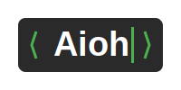

# Aioh - A Modern Text Editor for Nazm Programming Language



<div>
A high-performance text editor with hardware-accelerated rendering, designed specifically for the Nazm Arabic programming language.
</div>

## Overview

Aioh is a modern text editor built for [Nazm Programming Language](https://github.com/sherif-ibn-nasser/nazm-lang).
Using OpenGL for rendering, it provides smooth scrolling, crisp text rendering, and excellent performance even with
large files, while maintaining perfect RTL (Right-to-Left) support for Arabic text.

## Key Features

- 🚀 Hardware-accelerated rendering using OpenGL
- 🌐 Native RTL (Right-to-Left) support optimized for Arabic
- ⚡ Smooth scrolling and instant response
- 🎨 High-quality text rendering with subpixel antialiasing
- 📝 Syntax highlighting for Nazm language
- 🔍 Real-time error detection
- 🎯 Zero-latency typing experience
- 🌙 GPU-accelerated animations and transitions
- 💻 Support for high-DPI displays```**

## Links

- [Nazm Programming Language](https://github.com/sherif-ibn-nasser/nazm-lang)
- [Report Issues](https://github.com/yourusername/aioh/issues)
- [OpenGL Documentation](https://www.opengl.org/)
- [LWJGL](www.lwjgl.org)

---

<div align="center">
مُحرر نصوص عالي الأداء مخصص للغة نظم البرمجية
</div>
