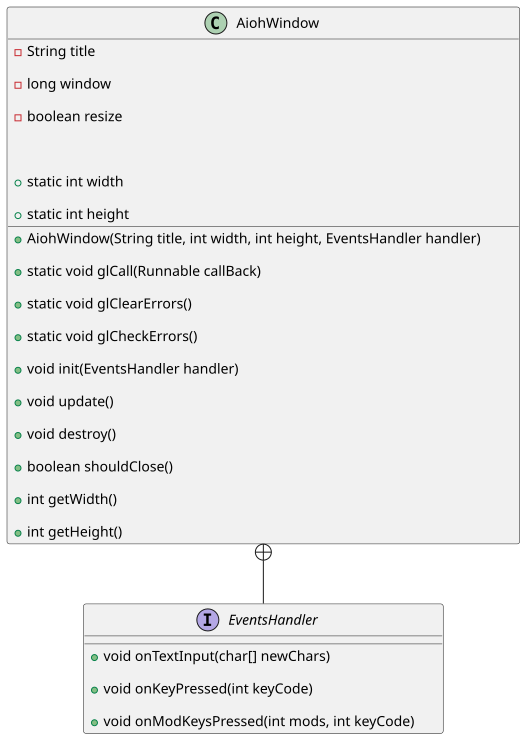

## Window Setup

In this section, we will walk through how to set up and manage a window in the Aioh editor using GLFW and OpenGL. The
window is the central part of any graphical application, and understanding how to create, configure, and handle events
is essential for building interactive applications.

### `AiohWindow` Class Overview

The `AiohWindow` class is responsible for setting up a GLFW window, handling OpenGL context, and processing various
input events. It abstracts the complexity of window creation and event handling into a simple interface for the Aioh
application.

<div style="text-align:center"></div>

### **Event Handling**

The `AiohWindow` class provides three key event handling methods:

- **onTextInput**: Handles text input when a character is typed.
- **onKeyPressed**: Handles key press events, such as when a key is pressed down.
- **onModKeysPressed**: Handles key press events with modifiers, such as Shift or Ctrl keys.

### Full code

src/main/java/com/aioh/AiohWindow.java:

```java
{{#include ../../src/main/java/com/aioh/AiohWindow.java}}
```